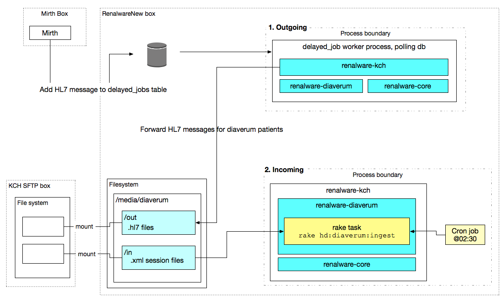

## Development

### Running

```
bundle install
bundle exec rake db:create
bundle exec rake db:migrate
bundle exec rake app:db:demo:seed
```



## Configuration

## Incoming

For each HD patient dialysing at a Diaverum unit, Diaverum will SFTP us an XML file
(probably overnight) containing HD Sessions for the last 30 days.

We import these sessions, mapping across various fields into for example Renal Registry codes.

## Outgoing

### HL7

Currently the only data we send to Diaverum are HL7 pathology results.

Whenever a new HL7 message arrives in Renalware, the `Diaverum::Outgoing::PathologyListener`
has the chance to inspect it; if it is for an HD patient dialysing at a Diaverum unit,
it drops (via a background job) a file containing the HL7 message into the Diaverum `out` folder
(probably a remote, mounted folder). The same file is also dropped into a local archive folder
so we can move the files again if there is a communications issue.

We also log result, payload, patient and hospital unit in the `diaverum.transmissions` table,
so that is the first port of call when debugging issues.

### Other data

Earlier in the development we sent patient XML files to Diaverum containing demographics and
pathology data. Path data is not sent via HL7, and we no longer send anything else.
If the need arises to send extended patient data to Diaverum then some the files are in this
repo - either look for `.dead` files or check the git history.
