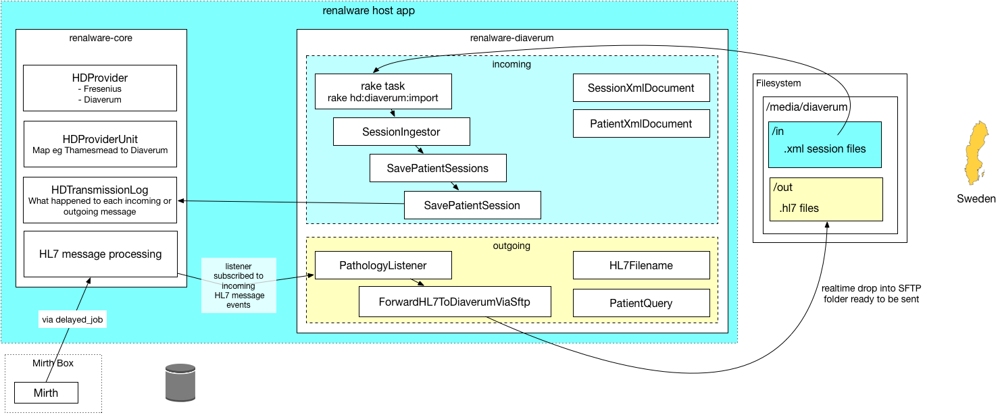

A Rails engine providing integration with Diaverum dialysers.

## Development

### Running

The gem has a built in test Renalware app you can run

```
bundle install
bundle exec rake db:create
bundle exec rake db:migrate
bundle exec rake db:seed
bin/web
```

Credentials are superkch renalware



## Configuration

## Incoming

For each HD patient dialysing at a Diaverum unit, Diaverum will SFTP us an XML file
(probably overnight) containing HD Sessions for the last 30 days.
We import these sessions into Renalware.

### Running the import script

```
bundle exec rake diaverum:ingest
or, if running in development
bundle exec rake app:diaverum:ingest
```

### Configuration

Configure in a host application using:

```
Renalware::Diaverum.configure do |config|
  config.xxx = "yyy"
end
```

The default configuration is in `lib/renalware/diaverum/configuration.rb` and is driven by an
ENV variable of the same name:

|          |               |       |
|----------|---------------|------:|
| `diaverum_incoming_skip_session_save` | Set to "false" to _actually_ import sessions rather then doing a dry run. |
| `DIAVERUM_INCOMING_SKIP_SESSION_SAVE` | |
| `diaverum_go_live_date` | e.g. "2018-11-01". Sessions (XML 'Treatments') earlier than this date will not be imported. |
| `DIAVERUM_GO_LIVE_DATE` | | |
| `honour_treatment_deleted_flag` | > If set to "true" then for each patient XML file, in addition to importing new sessions, |
| `HONOUR_TREATMENT_DELETED_FLAG` | we look at the backlog of sessions in the file (most of which should have already been imported) |
| | and if we find an imported session that now has a `Deleted=1`, we soft delete that session. |
| | This allow for the Diaverum to mark accidentally-created or erroneous sessions for deletion. |


## Outgoing

### HL7

Currently the only data we send to Diaverum are HL7 pathology results.

Whenever a new HL7 message arrives in Renalware, the `Diaverum::Outgoing::PathologyListener`
has the chance to inspect it; if it is for an HD patient dialysing at a Diaverum unit,
it drops (via a background job) a file containing the HL7 message into the Diaverum `out` folder
(probably a remote, mounted folder). The same file is also dropped into a local archive folder
so we can move the files again if there is a communications issue.

We also log result, payload, patient and hospital unit in the `diaverum.transmissions` table,
so that is the first port of call when debugging issues.

Note that although we drop the HL7 files in real-time into the SFTP folder, ready to send,
this does not mean they are received in real-time at Diaverum. A cron job would normally
schedule the SFTP sync.

### Other data

Earlier in the development we sent patient XML files to Diaverum containing demographics and
pathology data. Path data is not sent via HL7, and we no longer send anything else.
If the need arises to send extended patient data to Diaverum then some the files are in this
repo - either look for `.dead` files or check the git history.
